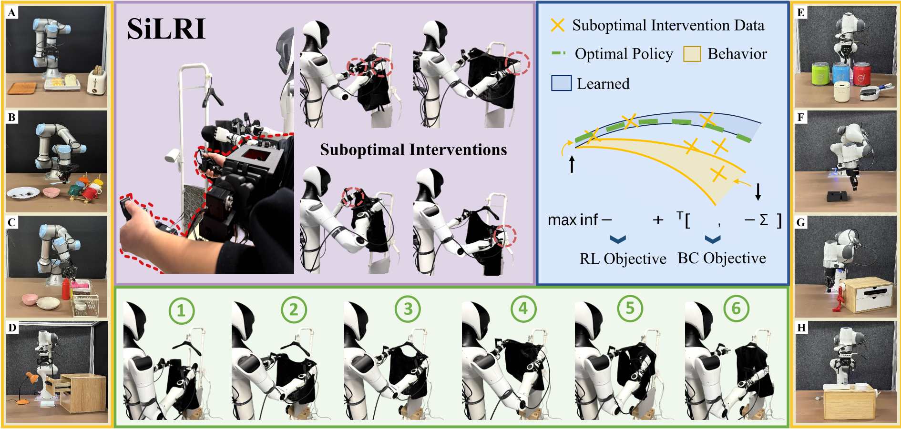
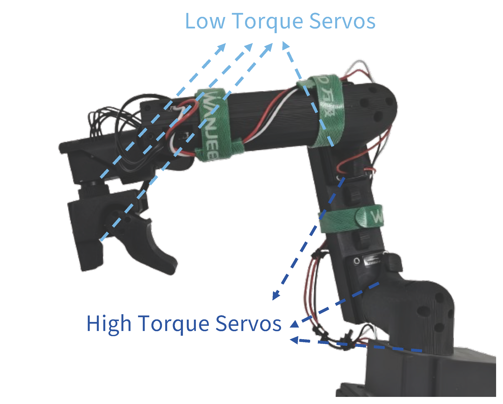

<div align="center">

# Real-world Reinforcement Learning from <br> Suboptimal Interventions 

<p align="center">
  
</p>


SiLRI: A state-wise Lagrangian RL algorithm for real-world robotic manipulation that enables efficient online learning from suboptimal interventions.

> Yinuo Zhao<sup>1,2</sup>, Huiqian Jin<sup>1,3</sup>, Lechun Jiang<sup>1,3</sup>, Xinyi Zhang<sup>1,4</sup>, Kun Wu<sup>1</sup>, Pei Ren<sup>1</sup>, Zhiyuan Xu<sup>1,&dagger;</sup>, Zhengping Che<sup>1,&dagger;</sup>, Lei Sun<sup>3</sup>, Dapeng Wu<sup>2</sup>, Chi Harold Liu<sup>4</sup>, Jian Tang<sup>1,&#9993;</sup>

<sup>1</sup>Beijing Innovation Center of Humanoid Robotics,
<sup>2</sup>City University of Hong Kong  
<sup>3</sup>Nankai University,
<sup>4</sup>Beijing Institute of Technology


<sup>&dagger;</sup>Project leader,
<sup>&#9993;</sup>Corresponding author,

[](https://arxiv.org/abs/2512.24288)
 [](https://silri-rl.github.io/)


<!-- [\[📖 Documents\]](#-documents) [\[🚀 Installation\]](#-installation) [\[📖 Training Recipe\]](#-training-recipe)  [\[🙋 FAQs\]](#-faqs) -->

[\[🚀 Installation\]](#-installation) [\[📖 Training Recipe\]](#-training-recipe)  [\[📦 Resources\]](#-resources)  [\[🙋 FAQs\]](#-faqs)


</div>

Here is a clearer and more concise version:

## Update Logs

### v1.0.1

#### Improvements

* Added SpaceMouse intervention support. Set `intervention_backend` to `spacemouse` to enable it. The default backend remains `xtele`. (Contributor: [@lihanlian](https://github.com/lihanlian))

#### Fixes

* Fixed an error caused by updates to the remote `helper2424/resnet10` repository:

```python
ValueError: Unrecognized configuration class <class 'transformers_modules.helper2424.resnet10.4a8c1df3969cf6e51106afe0966a2655da6674ec.configuration_resnet.ResNet10Config'> for this kind of AutoModel: AutoModel.
```


### v1.0
#### Improvements
- Adapt to the control logic of single-arm/dual-arm robots
- Optimize code format and comments to improve maintainability

#### Fixes
- Fixed the dimension error of `observation.state` in JSON files
- Implemented the resume function to support recovery after training interruption

### v0.0
#### Core Features
- Implemented the control framework for single-arm robots
---

## TODO List

* [✅] **Real World:** Release the 3D model and corresponding shopping list for the homogeneous UR arm.
* [✅] **Real World:** Release the 3D STL files for UR robots.
* [ ] **Real World:** Release the Docker image and the `xrocs`/`xtele` packages for Franka.
* [ ] **Simulator:** Release simulator examples for users without a teleoperation system.


## Repository Structure

**HIL-RL** (key components)

* `actor.py`: Actor script that queries actions from `lerobot` and executes them on the robot via `rl_envs`.
* `learner.py`: Learner script that receives transitions from the actor and sends updated model parameters back.
* `train_config_silri_franka.json`: LeRobot model configuration file for training runs on the Franka robot.
* `rl_envs/`: Robot environments and wrappers (Franka and UR supported).
    * `xrocs/`: Interface package connecting actor with robot, camera, and gripper components.
    * `xtele/`: Interface package connecting actor with teleoperation system.
* `lerobot/`: Open-source RL baseline library. In addition to `HIL-SERL`, we added `SilRI` and `HG-Dagger`.

**HIL-RL** (other components)

* `collect_data.py`: Collects 20 offline demonstrations to train a task-specific reward classifier and to initialize the intervention buffer.
* `split_data.py`: Splits offline demonstrations into success and failure samples based on rewards, ensuring balanced training and fine-tuning for the reward classifier.
* `train_reward_classifier.py`: Trains the task-specific reward classifier.
* `cfg/`: Configuration files for robot and task setup.


## 📖 Documents

This repository is built upon a fork of [Lerobot](https://github.com/huggingface/lerobot) and [HIL-SERL](https://github.com/rail-berkeley/hil-serl). Unlike the original `hil-serl` and `ConRFT` JAX implementation, we reimplement all algorithms in PyTorch for improved usability and better compatibility with the robotics community.

For common questions, please refer to `docs/` for details.

## 🚀 Installation


Download our source code:
```bash
git clone --recurse-submodules https://github.com/nuomizai/HIL-RL.git
cd HIL-RL
```
Create a virtual environment, then install the dependencies:
```bash
conda create -n silri python=3.10
conda activate silri

cd lerobot && pip install -e . && cd ..
pip install torch==2.1.1 torchvision==0.16.1 torchaudio==2.1.1 --index-url https://download.pytorch.org/whl/cu121

pip install -r requirements.txt

# [optional]
cd rl_envs/xrocs && pip install -e . && cd ../../
cd rl_envs/xtele && pip install -e . 
cd xtele/scripts && bash install_all.sh && cd ../../../../
```
Some users may need to run the following command:
```
pip uninstall torchcodec

```

To validate if `xrocs` and `xtele` are correctly installed, please refer to [rl_envs/README.md](https://github.com/nuomizai/rl_envs) for more details.

## 📖 Training Recipe

The overall training pipeline follows [HIL-SERL](https://github.com/rail-berkeley/hil-serl). Specifically, real-world RL training consists of three stages:


### 📑 Stage 1: Offline Data Collection

First, collect 20 demonstration trajectories by running:

```bash
bash collect_data.sh
```

In `collect_data.sh`, set `robot_type` (configured in `cfg/robot_type`) and `task_name` (configured in `cfg/task`). You may also want to override the following parameters for your platform and task:

```yaml
# Robot (e.g., cfg/robot_type/franka.yaml)
image_crop: Crop the third-view image to focus on the region of interest.
image_keys: Camera names matching your setup.
```

```yaml
# Task (e.g., cfg/task/close_trashbin_franka_1028.yaml)
abs_pose_limit_high: Upper bound of the absolute pose limits (safety).
abs_pose_limit_low: Lower bound of the absolute pose limits (safety).
reset_joint: Joint values used for reset.
fix_gripper: Whether to keep the gripper fixed.
close_gripper: If fix_gripper is true, keep the gripper always open or always closed.
max_episode_length: Maximum steps per episode.
```


Next, split the dataset into success and failure subsets by running `bash split_data.sh` to address class imbalance during classifier training (negative samples ≫ positive samples).


### 📑 Stage 2: Reward Classifier Training

Train a task-specific reward classifier on success/failure subsets by running `bash train_reward_classifier.sh`. In the script, set `task_name` and `dataset.root`.

### 📑 Stage 3: Online RL Training

In this stage, we train a robust robot manipulation policy with RL/IL algorithms. Specifically, there are serveral key parameters you need to specify in `actor.sh`, `learner.sh`, and their corresponding configuration files:

```yaml
# actor.sh:
task_name: the task name same as that under cfg/task/, e.g., close_transhbin_franka_1028
robot_type@_global_: the robot platform same as that under cfg/robot_type, e.g., franka
classifier_cfg.require_train: continue to train the classifier during RL training, we set True for all tasks
use_human_intervention: enable human intervention during RL training, always True, set False only when debugging.
ego_mode: intervene and reset scene by one person, set False if you have others assist to reset.
policy_type: silri (ours), hgdagger(HG-Dagger), sac(HIL-SERL)
```

```yaml
# learner.sh
same as that in actor
```

```yaml
# train_config_silri_franka.json, most parameters can be override by that specified in actor.sh/learner.sh, other key parameteres are:
policy.actor_learner_config.learner_host: the ip of learner server

```

After configureing all these above parameters, first run the learner on learner server by running `bash learner.sh`, then, run the actor process on actor server by running `bash actor.sh`.


## 📦 Resources
Here we list the required resources and their purchase links for building the following homogeneous UR arm.

<p align="center">
  
</p>

| Item                               | Spec.                                                   | Quantity    | Acquisition Method                                                                                                                                                                                                                                                                                        |
| ------------------------------------ | --------------------------------------------------------- | ------------- | ----------------------------------------------------------------------------------------------------------------------------------------------------------------------------------------------------------------------------------------------------------------------------------------------------------- |
| High-Torque Servo                  | Dynamixel XL430-W250-T                                  | 3           | [shop-link](https://item.taobao.com/item.htm?id=588178867677&mi\_id=0000W4dQA6lUysc81YygntRUYzRUyrksuq3sH2XqEN5bjdA&spm=a21xtw.29178619.0.0&xxc=shop)                                                                                                                                                                  |
| Low-Torque Servo                   | Dynamixel XL330-M288-T                                  | 4           | [shop-link](https://item.taobao.com/item.htm?id=638117456346&mi\_id=0000Km7LN-eylH961vwB4ONT1-e3QjsHiDTfXkJmjuGMjfk&spm=a21xtw.29978516.0.0&xxc=shop)                                                                                                                                                                  |
| Low-Torque Servo                   | Dynamixel XL330-M077-T                                  | 1           | [shop-link](https://item.taobao.com/item.htm?id=638814318650&mi\_id=00005\_M-EgJ7G3Z086EOSlY4l75MMSXDfTsP\_GXgeqOYvv8&spm=a21xtw.29978516.0.0&xxc=shop)                                                                                                                                                                |
| base-1                             | ABS                                                     | 1           | [base-1.SLT](https://drive.google.com/file/d/1PIfdqjkkhDV1_-lPo3KQ3-JkvKTCe_-_/view?usp=drive_link)                                                                                                                                                                                                                                                                            |
| base-2                             | ABS                                                     | 1           | [base-2.STL](https://drive.google.com/file/d/1_wdr0Eu8ZCzebFqMAY1TgQNBdMAd16QK/view?usp=drive_link)                                                                                                                                                                                                                                                                            |
| L1                                 | ABS                                                     | 1           | [L1.STL](https://drive.google.com/file/d/1p8khpBvZdinE7lHrT4K6ww9iGjbYqoJM/view?usp=drive_link)                                                                                                                                                                                                                                                                            |
| L2                                 | ABS                                                     | 1           | [L2.STL](https://drive.google.com/file/d/1H-hZz0nnlOKcbmI6skdGB7BJIkg90KS2/view?usp=drive_link)                                                                                                                                                                                                                                                                            |
| L3                                 | ABS                                                     | 1           | [L3.STL](https://drive.google.com/file/d/14cqPtbG57uQRZ7UITr4zF8-TBKPyVNrL/view?usp=drive_link)                                                                                                                                                                                                                                                                            |
| L4                                 | ABS                                                     | 1           | [L4.STL](https://drive.google.com/file/d/1B4AWqLHD5qCiUipDA9MiLriARvVy2xG6/view?usp=drive_link)                                                                                                                                                                                                                                                                            |
| L5                                 | ABS                                                     | 1           | [L5.STL](https://drive.google.com/file/d/12AqxHv1EHWU9DqBVqSy_EXgPe4tjl8If/view?usp=drive_link)                                                                                                                                                                                                                                                                            |
| handle-1                           | ABS                                                     | 1           | [handle-1.STL](https://drive.google.com/file/d/1JSLaAqGAOf870neMlcRPvyu7ZmwSk7zW/view?usp=drive_link)                                                                                                                                                                                                                                                                            |
| handle-2                           | ABS                                                     | 1           | [handle-2.STL](https://drive.google.com/file/d/1iBcsDosUp20565ItNQLneZiw5ldw7owm/view?usp=drive_link)                                                                                                                                                                                                                                                                            |
| Hook and Loop Ties                 | -                                                       | 1           | [shop-link](https://item.jd.com/100188196436.html)                                                                                                                                                                                                                                                                     |
| G-Clamp                            | -                                                       | 1           | [shop-link](https://item.jd.com/100121851816.html)                                                                                                                                                                                                                                                                    |
| Servo Driver Board                 | -                                                       | 1           | [shop-link](https://item.taobao.com/item.htm?abbucket=11&id=738955630278&mi\_id=00007TRYnTZBR5nCe5WFMdNRU-Jsq2oo0fEDgdPz9vwTuwA&ns=1&priceTId=2147818117720205094592854e1a6f&skuId=5096459344123&spm=a21n57.1.hoverItem.2&utparam=%7B%22aplus\_abtest%22%3A%22f566cc0383e8c2646ccb8c706fe70c84%22%7D&xxc=taobaoSearch) |
| 304 Stainless Steel Torsion Spring | 0.9mm Wire Dia x 8mm OD x 5 Coils x 180° x Left-Handed | 1           | Customized|
| Screws                             | -                                                       | As Required | -                                                                                                                                                                                                                                                                                                         |
| Buck Converter                     | LM2596S                                                 | 1           | [shop-link](https://detail.tmall.com/item.htm?abbucket=19&id=617133394293&rn=58c6cfb58279aea4f3b9092d89459ffa&skuId=4524371507783&spm=a1z10.3-b-s.w4011-23941273512.106.64ba6dcbW95LpN)                                                                                                                                |


## License

This project is released under the [Apache License](LICENSE). Parts of this project contain code and models from other sources, which are subject to their respective licenses.

## Citation

If you find this project useful in your research, please consider cite:

```BibTeX
@article{zhao2025real,
  title={Real-world Reinforcement Learning from Suboptimal Interventions},
  author={Zhao, Yinuo and Jin, Huiqian and Jiang, Lechun and Zhang, Xinyi and Wu, Kun and Ren, Pei and Xu, Zhiyuan and Che, Zhengping and Sun, Lei and Wu, Dapeng and others},
  journal={arXiv preprint arXiv:2512.24288},
  year={2025}
}
```

## 🙋 FAQs
We summarize common questions in the `docs/` directory. If you encounter an issue not covered there, please open a GitHub issue or contact `linda.chao.007@gmail.com` directly. We welcome feedback and contributions.


## Acknowledgement
HIL-RL is built with reference to the code of the following projects: [Lerobot](https://github.com/huggingface/lerobot), [HIL-SERL](https://github.com/rail-berkeley/hil-serl). Thanks for their awesome work!


